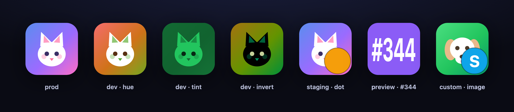

# favicon-env

Tint your favicon per environment so you can tell instances apart at a glance — no more staring at three identical tabs wondering which one is production.



**[▶ Live, clickable demo](https://amir-abushanab.github.io/favicon-env/)**

- **Runtime mode** — one import, any framework, any deploy. Detects the environment in the browser and re-tints the favicon on a `<canvas>`, so it works with whatever favicon you already have (svg / png / ico).
- **Build-time mode** — a tiny SVG helper that bakes the tint in at build/SSR time, for zero first-paint flash.
- **Zero dependencies.** ~2.3 kB min+gzip (the build-time SSR helper alone is ~1.7 kB).

## Install

```sh
pnpm add favicon-env
```

> **Using an AI coding agent?** favicon-env ships an [Agent Skill](https://tanstack.com/intent) (via TanStack Intent) — run `npx @tanstack/intent@latest install` and your agent picks up the correct patterns (framework placement, badges, runtime vs SSR) straight from the package, versioned with it.

## Runtime mode

```js
import { envFavicon } from 'favicon-env'

envFavicon({
  environments: {
    dev:     { hue: 130 },          // hue-rotate degrees
    staging: { badge: '#f59e0b' },  // …or a corner dot that keeps the logo intact
    // prod omitted → left untouched
  },
})
```

Call it once on the client, as early as you can — it reads the current `<link rel="icon">`, redraws it tinted, and swaps it in. It's a no-op during SSR (it guards on `document`), so it's safe to import anywhere. Where it goes in the common setups:

<details>
<summary><b>Next.js</b> — App Router</summary>

```tsx
// app/favicon-env.tsx — a client component
'use client'
import { useEffect } from 'react'
import { envFavicon } from 'favicon-env'

export function FaviconEnv() {
  useEffect(() => {
    void envFavicon({ /* …environments, as above… */ })
  }, [])
  return null
}
```

Then render `<FaviconEnv />` once inside `<body>` in `app/layout.tsx`. `useEffect` is the right hook here — a run-once, client-only side effect, safe under React StrictMode's double-invoke (re-tinting is idempotent). (Next ≥ 15.3: drop the call into `instrumentation-client.ts` and skip the component entirely. Pages Router: put the `useEffect` in `pages/_app.tsx`.)

</details>

<details>
<summary><b>TanStack Router / Start</b></summary>

```tsx
// src/main.tsx — your client entry, before you render the router
import { envFavicon } from 'favicon-env'

void envFavicon({ /* …environments, as above… */ })
```

The entry runs on the client, so no `useEffect` is needed. (TanStack Start / SSR: the same call in your client entry is a no-op on the server, thanks to the `document` guard.)

</details>

<details>
<summary><b>Astro</b></summary>

```astro
---
// src/layouts/Layout.astro — a client <script>, bundled and run in the browser
---
<script>
  import { envFavicon } from 'favicon-env'
  void envFavicon({ /* …environments, as above… */ })
</script>
```

For Astro you can also bake the tint straight into the HTML for **zero first-paint flash** — see the *Build-time / SSR mode* section below, which is the recommended path when you control the favicon SVG.

</details>

<details>
<summary><b>Vite SPA · Vue · Svelte · vanilla</b></summary>

```js
// your client entry — src/main.ts, main.js, …
import { envFavicon } from 'favicon-env'

void envFavicon({ /* …environments, as above… */ })
```

The entry module already runs in the browser, so no framework hook is needed. (In Vue you could equally call it from `onMounted` in your root component.)

</details>

By default the environment is guessed from the hostname (`localhost` / `*.local` / raw IPs → `dev`; a `staging`/`preview`/`qa`/… segment → `staging`; everything else → `prod`). Override it:

```js
envFavicon({
  environments: { /* … */ },
  detect: () => (location.port === '4000' ? 'staging' : 'prod'),
})
```

Environment **names are arbitrary** — they're just keys into `environments`, so you aren't limited to `dev`/`staging`/`prod`. Define your own and return them from `detect` (the built-in heuristic only emits the three defaults, so custom names need a custom `detect`):

```js
envFavicon({
  environments: {
    canary: { hue: 280 },
    demo:   { badge: '#22c55e' },
  },
  detect: () => {
    if (location.hostname.startsWith('canary.')) return 'canary'
    if (location.hostname.endsWith('.demo.acme.com')) return 'demo'
    return 'prod' // not in the map → favicon left untouched
  },
})
```

`detect` can key off anything, not just the hostname — e.g. `detect: () => import.meta.env.MODE`.

### Exact colours

`hue` *rotates* the icon's colours, so the result depends on your base icon (and it barely moves white/black/grey). When you want a **specific** colour per environment, use `tint` — it colourises the icon to that exact colour while keeping its shape and shading (a duotone), so a white logo becomes solid `tint`:

```js
envFavicon({
  environments: {
    dev:     { tint: '#22c55e' }, // exact green, artwork preserved
    staging: { tint: '#f59e0b' }, // exact amber
  },
})
```

Want a flat single-colour block instead of a duotone? Use a text-less `cover` badge (`{ badge: { color: '#22c55e', shape: 'cover' } }`). Want a different icon entirely? Use `src`.

### Auto mode

Don't want to name environments at all? Derive a **stable, unique hue from `location.host`**, so every origin *and port* automatically gets its own colour — perfect for telling several dev servers apart:

```js
envFavicon({ auto: true })
```

### Badges, PR numbers & URL rules

A `badge` is either a colour (a dot) or an object with `text` — handy for preview deploys, where you want the **PR number** on the icon. The cleanest way is a `rules` list: match the URL with a `RegExp` and drop its captures straight into the text with `$1` / `$<name>`:

```js
envFavicon({
  rules: [
    // e.g. a preview deploy at pr-344.myapp.dev  →  a "#344" pill
    { match: /^pr-(\d+)\./, badge: { text: '#$1', color: '#8b5cf6' } },
    { match: /staging\./, hue: 45 },
  ],
})
```

`match` is tested against `location.host` (so `:port` is included). Rules are tried in order — first match wins — then fall through to `auto` / `environments` if none match. Need more than the host? Use a function: it receives the full `URL`, and `text` can be a function too:

```js
rules: [
  {
    match: (url) => url.searchParams.has('pr'),
    badge: { text: (match, url) => `#${url.searchParams.get('pr')}` },
  },
]
```

`textColor` defaults to auto (black/white by contrast with `color`).

Multi-digit numbers get cramped in a corner at 16px. `shape: 'cover'` replaces the icon with a full-bleed number so it reads even in the tab (or keep the icon and just enlarge the pill with `size` + `corner: 'center'`):

```js
{ badge: { text: '#344', color: '#8b5cf6', shape: 'cover' } }
```

### A different image per environment

Set `src` to swap the base image outright for an environment — e.g. a distinct staging logo. Any `hue` / `filter` / `badge` still composites on top:

```js
envFavicon({
  environments: {
    staging: { src: '/favicon.staging.svg' },
    preview: { src: '/favicon.svg', badge: { text: '#344' } },
  },
})
```

A plain `src` with no recolour/badge is applied directly (no canvas), so cross-origin images and crisp vectors just work.

### No build step

Drop in a `<script>` tag; it auto-runs from `data-*` attributes and also exposes `window.faviconEnv`:

```html
<!-- unique colour per host, zero config -->
<script src="https://unpkg.com/favicon-env/dist/favicon-env.global.js" data-auto></script>

<!-- or name your environments (hue in degrees) -->
<script
  src="https://unpkg.com/favicon-env/dist/favicon-env.global.js"
  data-dev="130"
  data-staging="45"
></script>
```

## Build-time / SSR mode

If you control the favicon SVG and want **no flash**, bake the tint in at build time instead. `faviconDataUri` returns a ready `href`:

```astro
---
// src/pages/index.astro
import { faviconDataUri } from 'favicon-env/ssr'
import favicon from '../favicon.svg?raw'

const env = import.meta.env.PUBLIC_APP_ENV ?? (import.meta.env.DEV ? 'dev' : 'prod')
const tint = { dev: { hue: 130 }, staging: { hue: 45 }, prod: false }[env]
---
<link rel="icon" type="image/svg+xml" href={faviconDataUri(favicon, tint)} />
```

`favicon-env/ssr` is pure string manipulation with no DOM dependency, so it's safe to run in Node during a build. Badges work here too — they're baked into the SVG (positioned via its `viewBox`), so you can stamp a PR number at build time with no flash:

```js
const pr = process.env.VERCEL_GIT_PULL_REQUEST_ID
faviconDataUri(favicon, pr ? { badge: { text: `#${pr}` } } : { hue: 45 })
```

### Vite

A plain Vite SPA has no template to bake the tint into — its `index.html` is static. Drop this small plugin into your `vite.config` to rewrite the `<link rel="icon">` at build time, choosing the tint from Vite's `mode`:

```js
// vite.config.js
import { readFileSync } from 'node:fs'
import path from 'node:path'
import { defineConfig } from 'vite'
import { faviconDataUri } from 'favicon-env/ssr'

// keyed by Vite `mode` (e.g. `vite build --mode staging`); omit prod to leave it untouched
const tints = {
  development: { hue: 130 },
  staging: { hue: 45 },
}

function faviconEnv() {
  let config
  return {
    name: 'favicon-env',
    configResolved(resolved) {
      config = resolved
    },
    transformIndexHtml(html) {
      const tint = tints[config.mode]
      if (!tint) return // no rule for this mode → leave the icon alone
      return html.replace(/<link\b[^>]*\brel=["']icon["'][^>]*>/i, (tag) => {
        const href = tag.match(/\bhref=["']([^"']+)["']/i)?.[1]
        if (!href?.endsWith('.svg')) return tag // SVG only; skip png/ico
        let svg
        try {
          svg = readFileSync(path.join(config.publicDir, href.replace(/^\//, '')), 'utf8')
        } catch {
          return tag // not in public/ (missing / bundled asset) → untouched
        }
        return tag.replace(/\bhref=["'][^"']*["']/i, `href="${faviconDataUri(svg, tint)}"`)
      })
    },
  }
}

export default defineConfig({
  plugins: [faviconEnv()],
})
```

Now `vite dev` and `vite build` serve the tint baked into the initial HTML — no first-paint flash — reading your favicon from `public/` and falling through untouched for non-SVG icons or a missing file. Prefer env vars to `--mode`? Swap `tints[config.mode]` for a lookup keyed off `loadEnv(config.mode, config.root, 'PUBLIC_').PUBLIC_APP_ENV`.

## API

### `envFavicon(options?): Promise<void>` — runtime

| option         | type                                  | default              | description                                                        |
| -------------- | ------------------------------------- | -------------------- | ------------------------------------------------------------------ |
| `environments` | `Record<string, EnvTint \| false>`    | —                    | Map of env name (any string) → tint. Missing/`false` = untouched.   |
| `rules`        | `EnvRule[]`                           | —                    | URL-matched tints, checked first; regex captures fill `badge.text`.|
| `detect`       | `() => string \| undefined`           | hostname heuristic   | Return the current env name (a key of `environments`).             |
| `auto`         | `boolean \| { offset?: number }`      | `false`              | Ignore `environments`; derive a unique hue from `location.host`.   |
| `source`       | `string`                              | current icon / `.ico`| Favicon URL to tint.                                               |
| `size`         | `number`                              | `64`                 | Canvas raster size in px.                                          |

`EnvTint`: `{ hue?: number; tint?: string; filter?: string; src?: string; badge?: string | Badge }`. `hue` rotates the icon's hue (relative); `tint` colourises it to an *exact* colour (a duotone that keeps the artwork's shape + shading — a white logo becomes solid `tint`); `filter` (any CSS filter) beats both; `src` replaces the base image for that env; `badge` is a colour string (a dot) or a `Badge`. Everything composites in one pass.

`Badge`: `{ text?: string | number; color?: string; textColor?: string; shape?: 'pill' | 'cover'; corner?: 'top-left' | 'top-right' | 'bottom-left' | 'bottom-right' | 'center'; size?: number; opacity?: number }`. Omit `text` for a dot; include it for a pill. `color` sets the background and `textColor` the text (default: auto black/white by contrast). Two styles: the default `'pill'` sits on top of your icon (placed by `corner`/`size`); `'cover'` replaces the whole icon with the colour + number, best for a multi-digit number that must read at 16px. `opacity` (0–1) fades the badge — with `'cover'`, below `1` it lets your icon show *through* the number (a watermark). Everything composites in one pass, so you can combine `src` + `hue`/`filter` + `badge`.

`EnvRule`: an `EnvTint` plus `match: RegExp | ((url: URL) => boolean)`. A `RegExp` is tested against `location.host` and its captures interpolate into `badge.text` (`$1`, `$<name>`); a function receives the `URL`, and in a rule `badge.text` may also be `(match, url) => string | number`.

### `favicon-env/ssr` — build-time

- `tintSvg(svg, tint) => string` — SVG string with the tint baked in as a wrapping filtered group.
- `svgToDataUri(svg) => string` — percent-encoded `data:image/svg+xml,…`.
- `faviconDataUri(svg, tint) => string` — the two combined; a ready favicon `href`.

### Helpers (from the main entry)

- `hashHue(input, offset?) => number` — the deterministic 0–359 hue used by auto mode.
- `defaultDetect(hostname?) => string` — the built-in `dev`/`staging`/`prod` heuristic.
- `matchRules(rules, url) => EnvTint | null` — the pure rule matcher (first match wins, captures interpolated). Reuse it server-side with a request `URL` and feed the result to `favicon-env/ssr`'s `faviconDataUri`.

## How it works & caveats

- **Achromatic pixels barely move.** `hue-rotate` leaves white/black/grey roughly alone, so highlights and outlines survive; only the coloured parts shift.
- **Runtime + cross-origin favicons.** Tinting draws to a canvas, so a cross-origin favicon served without CORS headers taints it — `envFavicon` catches that and leaves the icon untouched. Same-origin (the normal case) is fine.
- **First-paint flash.** Runtime mode briefly shows the untinted icon before JS runs. Use the SSR helper if that matters.
- **Browser support.** Runtime mode needs canvas `ctx.filter` (Baseline; unsupported browsers just get the untinted icon). SSR mode relies on SVG favicons honouring an embedded CSS `filter`, which all current evergreen browsers do.

## License

MIT © Amir Abushanab
